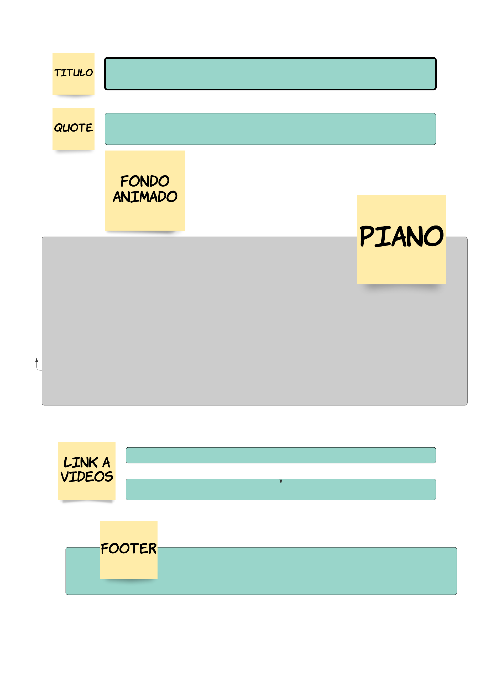

# **Music KeyBoard**

**Preámbulo:** El nuevo maestro de música de la escuela infantil del IVEC necesita una herramienta nueva para entrenar el oído de los niños antes de que comiencen sus lecciones en el piano. Pero al mismo tiempo necesita que sea llamativa y lo más parecida posible al piano real para no perder su atención y también necesita que sea fácil de llevar siempre consigo.

**Problema:** Se necesita un piano que se pueda manejar con la computadora del maestro.

**Solución:** Necesitamos crear un piano que pueda ser tocado con las teclas de la computadora y que cada tecla represente una nota musical, también se necesita ue sea llamativo a la vista para mantener la atención de los niños.

---
**Diagrama de Flujo**

---
**Diseño de Interfaz**
